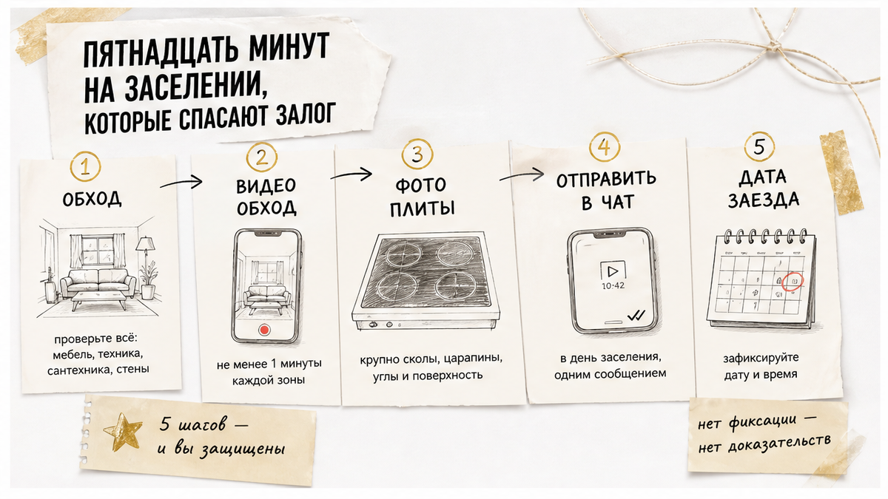
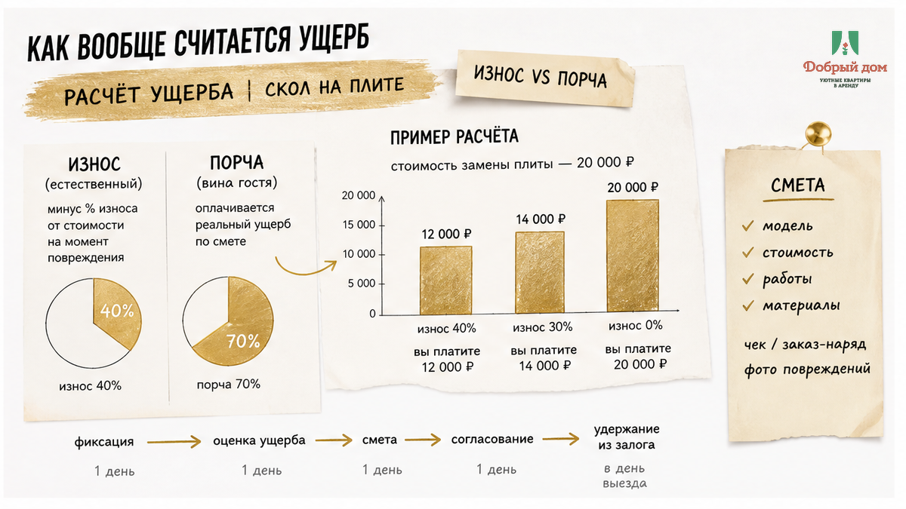
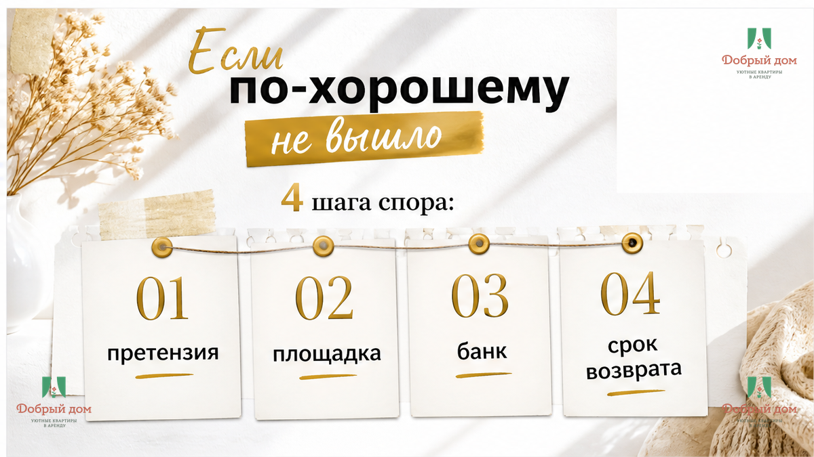
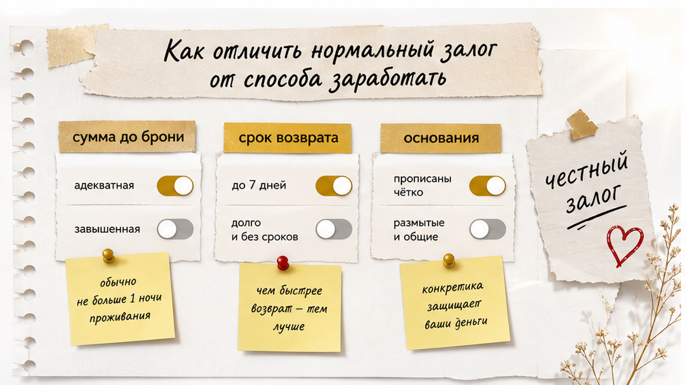
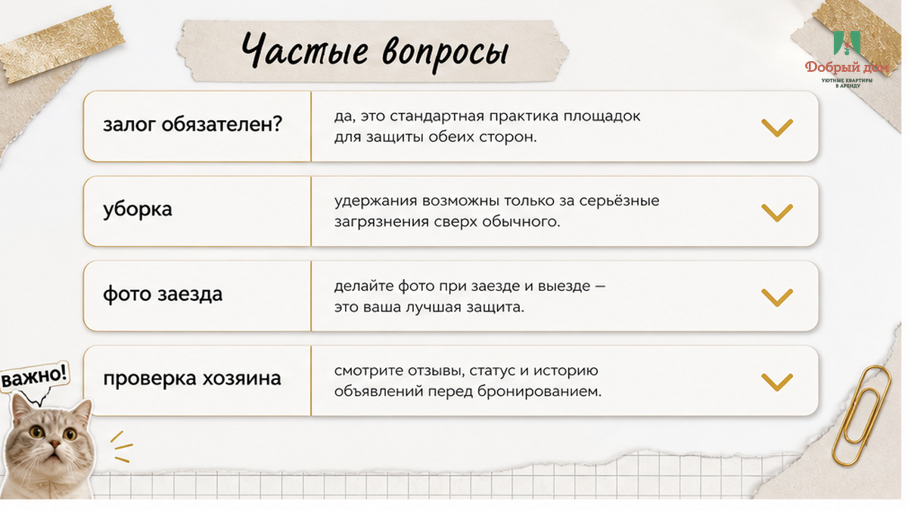

# Sol B02 — Klyshin delivery voice rewrite

## CRITICAL
- Read drafts/writer.html — ALL facts, links, funnel hooks must survive
- Read shared/SOUL.md + shared/article-style.md
- h1 is NOT in article.html (theme adds it)
- Output: HTML fragment ONLY — no fences, no DOCTYPE, no h1

## Figure placement (EXACT — after these H2, use inline-quad class)

After `<h2>Залог — это не оплата, это гарантия</h2>`:
<figure class="inline-quad" data-slot="inline_1"></figure>

After `<h2>Пятнадцать минут на заселении` (or similar title):
<figure class="inline-quad" data-slot="inline_2"></figure>

After `<h2>Как на самом деле считается ущерб</h2>` or damage section:
<figure class="inline-quad" data-slot="inline_3"></figure>

After `<h2>Если по-хорошему не вышло</h2>`:
<figure class="inline-quad" data-slot="inline_4"></figure>
(alt ok — no word «суд» in prose)

After `<h2>Как отличить нормальный залог` section:
<figure class="inline-quad" data-slot="inline_5"></figure>

After `<h2>Как мы работаем с залогом в «Добром доме»</h2>`:
<figure class="inline-quad" data-slot="inline_6"></figure>

After `<h2>Частые вопросы</h2>`:
<figure class="inline-quad" data-slot="inline_7"></figure>

Remove <!-- FIGURE --> comments from writer draft.

## Funnel (must keep from writer)
- TG https://t.me/Dobriy_dom_72 after checklist with «полный список» / «в канале»
- MAX https://max.ru/id660300569233_biz or manager https://t.me/Dobriy_dom_Tyumen after Добрый дом block — instruction BEFORE check-in
- End: booking + tel:+79935748322

## Bans
No ЕГРН, нотариус, суд, я адвокат, мы лучшие, бизнес-класс in prose.

## Voice
Short Klyshin blows, scene para 1, humble host, comfort+ not luxury.
