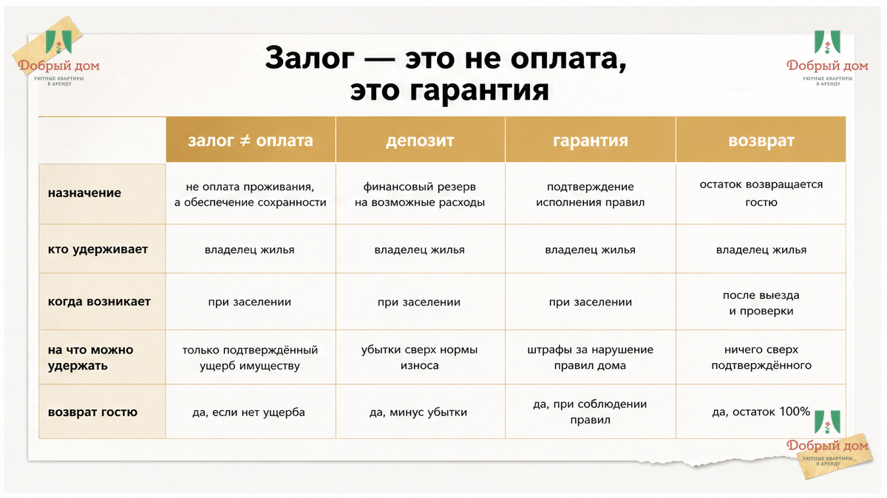

# Sol inputs B02 — RETRY (previous output was WRONG TOPIC — pansionat)

CRITICAL BLOCKERS:
- Topic MUST be залог посуточной аренды квартиры ONLY. Any пансионат/пожилой = FAIL.
- h1 EXACT: Снял квартиру посуточно. Залог не вернули — нашли скол на плите
- Output: HTML fragment ONLY — NO ``` fences, NO <!DOCTYPE>, NO <html><head> wrapper
- Keep ALL facts from drafts/writer.html — rewrite voice per shared/SOUL.md only
- Add 7 figures AFTER selected H2 sections:
  <figure class="article-figure" data-slot="inline-01"></figure>
  … through inline-07 with unique alt text matching section utility
- CTA replace placeholders with real URLs:
  booking https://добрыйдом-72.рф/booking/
  TG https://t.me/Dobriy_dom_72
  MAX https://max.ru/id660300569233_biz
  manager https://t.me/Dobriy_dom_Tyumen
  phone +7 993 574-83-22 / tel:+79935748322
- Interlink keep: /blog/beskontaktnoe-zaselenie-posutochno-tyumen/
- FAQ h2: Частые вопросы — keep Q&A from writer
- Humble brand line about Добрый дом Tyumen посуточно

Read full drafts/writer.html, shared/SOUL.md, title-brief.json
