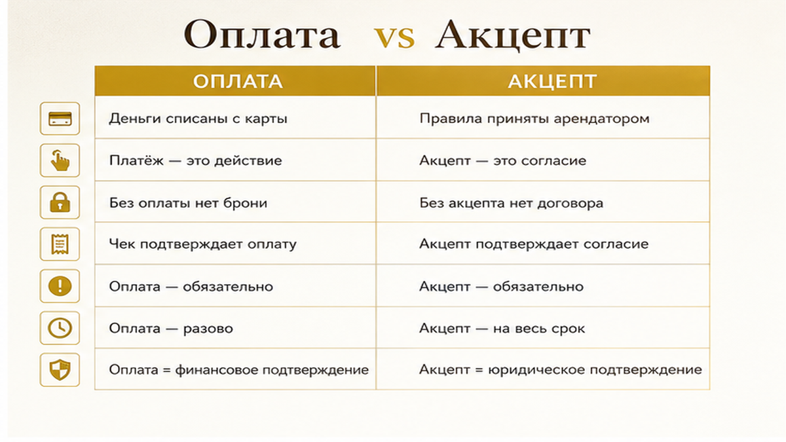
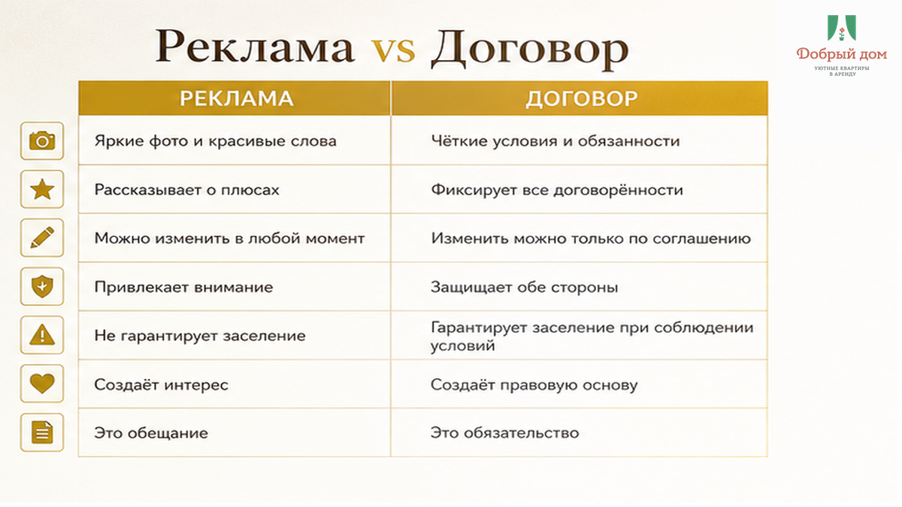
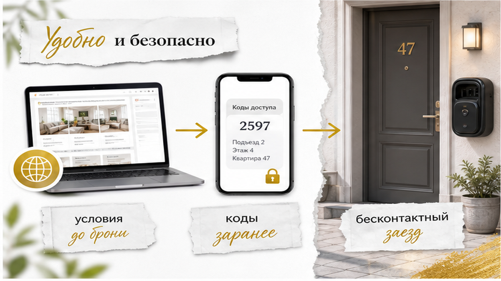

# Sol assembled inputs — B03 «Добрый дом»

OUTPUT: ONLY final `article.html` HTML fragment. **No** markdown fences. **No** DOCTYPE. **No** `<h1>` (theme adds H1 from title-brief). No commentary before/after HTML.

## title-brief.json

```json
{
  "topic_id": "B03",
  "slug": "dogovor-arendy-pravila-prozhivaniya-posutochno",
  "h1": "Перевёл предоплату — потом прочитал 7 запретов в договоре",
  "title": "Перевёл предоплату — потом прочитал 7 запретов в договоре",
  "dzen_pattern": 1,
  "verdict": "PASS"
}
```

## Voice (SOUL excerpt)

- Тенант: **«Добрый дом»** — посуточная аренда в **Тюмени**. Голос: **тёплый хост**, не юрист.
- Ритм Клышина: короткие удары, сцена в **первом абзаце**, «вот где подставят», диалог в кавычках.
- Комфорт+, скромно. От лица **компании** («мы»), не «я риэлтор».
- **Без** юридического дисклеймера в конце. **Без** канцелярита.
- **Бан в прозе:** ЕГРН, нотариус, суд, «я адвокат», «мы лучшие», бизнес-класс, WhatsApp.
- Не тащить Wordstat/research-дату в лид.
- Dzen pattern 1: в теле **ровно 7 пунктов** в `<ol>` — обещание H1 выполнено в первой половине.

## Funnel (HARD — mid-article, не только в конце)

1. **После чеклиста** «что проверить за 3 минуты»: фраза «полный список — в канале» + `https://t.me/Dobriy_dom_72`
2. **После блока «у нас в Добром доме так»**: MAX `https://max.ru/id660300569233_biz` **или** менеджер `https://t.me/Dobriy_dom_Tyumen` — инструкцию шлём **до заселения**
3. **Финал:** бронь `https://добрыйдом-72.рф/booking/`, сайт `https://добрыйдом-72.рф/`, телефон **+7 (993) 574-83-22** (единственный номер)

## Interlink (сохранить из writer)

- `/blog/beskontaktnoe-zaselenie-posutochno-tyumen/` — при ключах/кодах
- `/blog/perevel-zalog-za-posutochnuyu-na-vyezde-skazali-ne-vernem/` — при обеспечительном платеже (кратко)

## Figure placement (7× inline-quad — после указанных H2)

После `<h2>Быстрый инсайт</h2>` (добавь после лида, до юридического блока):
```html
<figure class="inline-quad" data-slot="inline_1"></figure>
```

После `<h2>Почему перевод денег иногда считается согласием</h2>`:
```html
<figure class="inline-quad" data-slot="inline_2"></figure>
```

После `<h2>Вот где подставят, если читать договор после перевода</h2>`:
```html
<figure class="inline-quad" data-slot="inline_3"></figure>
```

После `<h2>Семь пунктов, которые читают до перевода</h2>`:
```html
<figure class="inline-quad" data-slot="inline_4"></figure>
```

После `<h2>Что проверить за три минуты до перевода</h2>`:
```html
<figure class="inline-quad" data-slot="inline_5"></figure>
```

После `<h2>У нас в «Добром доме» так</h2>`:
```html
<figure class="inline-quad" data-slot="inline_6"></figure>
```

После `<h2>Частые вопросы</h2>` (добавь секцию FAQ: 3–4 пары `<h3>вопрос?</h3><p>ответ</p>` по фактам writer/research):
```html
<figure class="inline-quad" data-slot="inline_7"></figure>
```

Минимум **7 H2** до FAQ включительно + короткий финальный абзац без нового H2.

## Calibration (good-outputs rhythm — не копипаст)

- Крючок-вопрос: «А я на это соглашался?»
- Короткие абзацы, одно предложение = часто отдельный абзац.
- «Вот где подставят» — второй блок после лида.
- Чеклист с глаголами: проверьте, откройте, сравните.
- Без research-брифинга и SEO-хвостов.

## drafts/writer.html (facts — preserve ALL, rewrite voice only)

<p>Вы нашли квартиру в Тюмени, списались, вам скинули номер карты. Перевели предоплату — и только потом, уже в спокойной обстановке, открыли ссылку на правила проживания. А там: заезд с 15:00, выезд до 11:00, гостей не больше двух, ключи третьим лицам не передавать, курение запрещено даже на балконе, отмена — без возврата.</p>

<p>И вот вы сидите с телефоном в руке и думаете: а я на это соглашался?</p>

<p>Ответ простой и неприятный: если условия были опубликованы и доступны до оплаты, то во многих случаях — да. Поэтому единственное, что действительно работает, — открыть документ до перевода, а не после. Три минуты чтения экономят и деньги, и вечер по приезде.</p>

<h2>Почему перевод денег иногда считается согласием</h2>

<p>Когда вы снимаете квартиру посуточно, вы заключаете договор найма жилого помещения — в быту его называют арендой, но по Гражданскому кодексу это наём (статьи 671 и 674 ГК РФ). Форма может быть разной: подписанный документ, электронная анкета, публичная оферта на сайте.</p>

<p>С офертой история такая. По пункту 3 статьи 438 ГК РФ действие в ответ на предложение — например, оплата — может считаться акцептом, то есть согласием с условиями. Ключевое слово тут «может»: важно, чтобы условия были доступны вам до того, как вы нажали «перевести».</p>

<p>Из этого не следует, что любой перевод автоматически означает согласие со всем подряд. Если правил вам не показывали, ссылку не давали, а условия появились в переписке уже после оплаты — это совсем другой разговор. Но проверять это задним числом всегда дороже и дольше, чем прочитать заранее.</p>

<p>Кстати, интерес к теме в городе стабильный: только запрос «договор аренды квартиры» тюменцы вводят около 1974 раз в месяц. Люди читают. Просто чаще всего — уже после того, как перевели.</p>

<h2>Вот где подставят, если читать договор после перевода</h2>

<p>Первое: время. Вы приехали в командировку утренним поездом, а заезд с 15:00. Ранний заезд в правилах не обещан, хозяин занят, и вы ждёте с чемоданом.</p>

<p>Второе: количество гостей. Бронировали «на двоих», приехали втроём с ребёнком. В договоре — «не более двух человек, включая детей». Формально нарушение, и разговор пойдёт уже не о комфорте, а о доплате или выселении.</p>

<p>Третье: ключи и коды. Пункт «не передавать доступ третьим лицам» встречается почти везде. А вы собирались отдать код коллеге, который приезжает на день позже.</p>

<p>Четвёртое: отмена. Планы поменялись, вы пишете «верните», а в правилах — невозвратный тариф или удержание за отмену менее чем за сутки. Иногда в шаблонах пишут проценты вроде «удерживается 50%» — это не норма рынка, это конкретный текст конкретного договора. Именно поэтому его и надо читать.</p>

<p>Пятое: назначение жилья. Квартира сдаётся для проживания. Фотосессия, съёмка, переговоры на двадцать человек — это уже другое использование, и оно почти всегда под запретом.</p>

<h2>Семь пунктов, которые читают до перевода</h2>

<p>Это тот самый список, который стоит открыть, пока деньги ещё у вас.</p>

<ol>
  <li><strong>Часы заезда и выезда.</strong> Во сколько можно войти и до скольких надо освободить квартиру. Отдельно посмотрите, как оформляется поздний выезд: почти всегда это отдельное согласование с хозяином, а не ваше право по умолчанию.</li>
  <li><strong>Число гостей.</strong> Сколько человек может проживать, считаются ли дети, что будет, если приедет ещё один. Именно эта цифра чаще всего расходится с реальностью.</li>
  <li><strong>Ключи, коды и доступ.</strong> Кому можно передавать доступ в квартиру, можно ли впускать друзей и родственников, что делать, если ключ потерян. Если заселение бесконтактное, тут же смотрите, как именно приходит код и <a href="/blog/beskontaktnoe-zaselenie-posutochno-tyumen/">от какой двери он вообще должен быть</a>.</li>
  <li><strong>Курение.</strong> Уточните, где именно запрещено. Формулировка часто шире, чем кажется: не только в квартире, но и на балконе, и на лоджии, и это распространяется на электронные сигареты и вейпы.</li>
  <li><strong>Отмена и возврат.</strong> За сколько дней или часов можно отменить без потерь, что удерживается при поздней отмене, возвращается ли предоплата при досрочном выезде.</li>
  <li><strong>Назначение жилья.</strong> Квартира для проживания. Проверьте, есть ли отдельный запрет на съёмки, мероприятия и работу с посетителями.</li>
  <li><strong>Обеспечительный платёж.</strong> Есть он или нет, в какой сумме, когда возвращается и за что может быть удержан. Тут достаточно просто знать правила заранее — <a href="/blog/perevel-zalog-za-posutochnuyu-na-vyezde-skazali-ne-vernem/">спорить об этом на выезде</a> всегда хуже, чем договориться на входе.</li>
</ol>

<h2>Что проверить за три минуты до перевода</h2>

<ul>
  <li>Вам прислали ссылку на правила или оферту до оплаты, а не после.</li>
  <li>В документе есть дата, адрес и срок проживания — а не только реквизиты карты.</li>
  <li>Часы заезда и выезда совпадают с вашим поездом или рейсом.</li>
  <li>Число гостей в брони совпадает с числом людей, которые реально приедут.</li>
  <li>Условия отмены вы прочитали целиком, а не по диагонали.</li>
  <li>Понятно, кто и как передаёт ключ или код.</li>
  <li>Все договорённости — «пустим в 12», «можно с животным» — есть в переписке, а не только на словах.</li>
</ul>

<p>Полный список пунктов, разбор формулировок и примеры того, как выглядят понятные правила, мы выкладываем в нашем канале: <a href="https://t.me/Dobriy_dom_72">t.me/Dobriy_dom_72</a>. Там же — короткие заметки для тех, кто снимает квартиру в Тюмени впервые.</p>

<h2>У нас в «Добром доме» так</h2>

<p>Мы стараемся, чтобы к моменту перевода денег у гостя не оставалось вопросов «а что там дальше».</p>

<p>Условия проживания выложены на сайте, их видно до брони. Заезд бесконтактный: коды и ключи вы получаете заранее, вместе с инструкцией — куда идти, где подъезд, как открыть, где парковка. Никаких «ждите, хозяин подъедет через час» после ночного поезда.</p>

<p>Если у вас нестандартный график — ранний рейс, поздний выезд, приезд с ребёнком — об этом мы договариваемся до оплаты, а не в момент, когда вы уже стоите у двери с чемоданом. Август в Тюмени — время командировок и семейных поездок, и лишний час ожидания в такие дни стоит дорого.</p>

<p>Инструкцию по заселению отправляем до вашего приезда. Если удобнее общаться в MAX — пишите туда: <a href="https://max.ru/id660300569233_biz">max.ru/id660300569233_biz</a>. Если ближе Telegram, напрямую менеджеру: <a href="https://t.me/Dobriy_dom_Tyumen">t.me/Dobriy_dom_Tyumen</a>. Спросите заранее про часы, гостей и коды — это ровно те три вопроса, из-за которых чаще всего портится первый вечер.</p>

<p>Выбрать квартиру и посмотреть свободные даты можно на странице брони: <a href="https://добрыйдом-72.рф/booking/">добрыйдом-72.рф/booking/</a>. Все объекты и условия — на сайте <a href="https://добрыйдом-72.рф/">добрыйдом-72.рф</a>. Если проще голосом, звоните: +7 (993) 574-83-22.</p>

<p>Читать договор после перевода — привычка дорогая. Читать до — три минуты.</p>

## Fact-check constraints (research-notes — do not invent beyond writer)

- Не утверждать, что любой перевод = согласие со всем.
- Шаблонные проценты — только как пример шаблона, не норма рынка.
- Не выдумывать суммы залога для «Доброго дома».
- Сезон: август 2026 — командировки и семейные поездки (OK в тексте).
