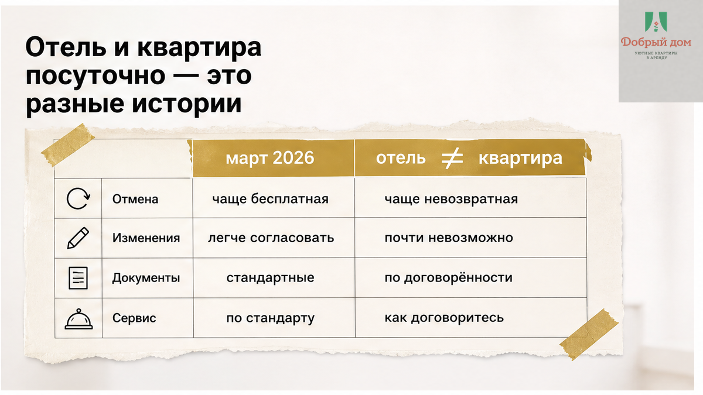
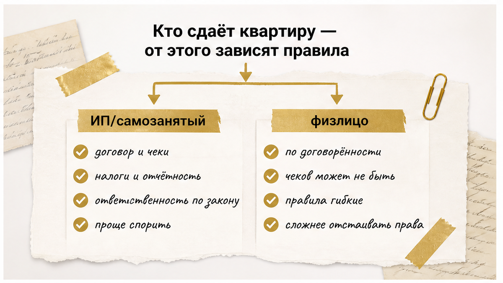
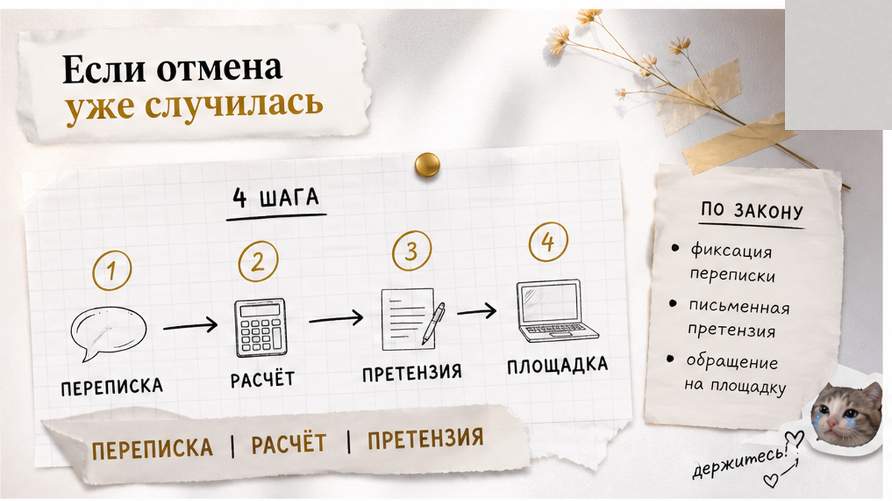

# Sol assembled inputs B03
OUTPUT: ONLY final article.html HTML fragment. No <h1> (theme adds it). No markdown fences. No commentary.

## title-brief.json
{
  "topic_id": "B03",
  "h1": "Планы сорвались — предоплату удержали. Что выяснить до оплаты",
  "title": "Планы сорвались — предоплату удержали. Что выяснить до оплаты",
  "slug": "otmena-bronirovaniya-posutochno-vozvrat-predoplaty",
  "subject": "отмена бронирования посуточно — возврат предоплаты",
  "angle": "Klyshin-ритм, dzen_pattern 3: страх удержания предоплаты → что выяснить до оплаты.",
  "verdict": "PASS"
}

## SOUL excerpt (Добрый дом)
Тенант: **«Добрый дом»** — посуточная аренда квартир в **Тюмени**.
Голос: **тёплый хост**, как объясняешь другу у двери подъезда. Не юрист, не договор.
**Калибровка ритма Клышина:** короткие удары, сцена в первом абзаце, «вот где вас подставят», «что сделать сегодня».
Комфорт+, скромно. Без ЕГРН, нотариус, суд, «я адвокат», «мы лучшие», бизнес-класс, WhatsApp.
Без юридического дисклеймера в конце.

## Voice rules
- Простой разговорный русский, короткие абзацы (часто одно предложение = абзац)
- Абзац 1: сцена + страх→инструкция (деньги ушли, планы сорвались)
- Абзац 2: «вот где подставят»
- После лида — **Быстрый инсайт** (3–6 коротких строк) если уместно
- Минимум 7 H2 до FAQ; FAQ: `<h2>Частые вопросы</h2>` + 4× `<h3>вопрос?</h3>
ответ
`
- Не research-дата, Wordstat, «полный гайд 2026» в лиде

## Figure placement (EXACT — after these H2, class inline-quad)

After first substantive H2 (отель vs квартира):
<figure class="inline-quad" data-slot="inline_1"></figure>

After H2 про кто сдаёт / статус арендодателя:
<figure class="inline-quad" data-slot="inline_2"></figure>

After H2 «Где подставляют»:
<figure class="inline-quad" data-slot="inline_3"></figure>

After H2 с пятью вопросами до оплаты:
<figure class="inline-quad" data-slot="inline_4"></figure>

After H2 «Если отмена уже случилась»:
<figure class="inline-quad" data-slot="inline_5"></figure>

After H2 «У нас так» / бренд Добрый дом:
<figure class="inline-quad" data-slot="inline_6"></figure>

After `<h2>Частые вопросы</h2>`:
<figure class="inline-quad" data-slot="inline_7"></figure>

## Funnel (HARD — preserve from writer)
a) После чеклиста 5 вопросов: «полный список — в канале» + https://t.me/Dobriy_dom_72
b) После блока «У нас так»: MAX https://max.ru/id660300569233_biz или менеджер https://t.me/Dobriy_dom_Tyumen — инструкцию шлём до заселения
c) Финал: https://добрыйдом-72.рф/ + tel:+79935748322

## Interlinks (preserve exactly)
- /blog/perevel-zalog-za-posutochnuyu-na-vyezde-skazali-ne-vernem/
- /blog/beskontaktnoe-zaselenie-posutochno-tyumen/

## drafts/writer.html (facts — preserve all, rewrite voice only)

Деньги ушли. Перевели предоплату за квартиру посуточно на август, а через неделю поездка сорвалась: командировку отменили, ребёнка положили в больницу, машина встала. Пишете хозяину — в ответ: «Оплата невозвратная, у нас оферта». И вот здесь решает не эмоция, а два действия.

<strong>Первое — ничего не удаляйте.</strong> Переписка, чек о переводе, скрин брони с датами и суммой. Это ваш единственный аргумент.

<strong>Второе — задайте письменно один вопрос:</strong> «Сколько вы удерживаете и какие фактические расходы уже понесены по моей брони?» Не спорьте, не давите. Просто попросите расчёт в том же чате, где бронировали. Очень часто после этого вопроса разговор про «невозвратно» превращается в разговор про «вернём столько-то».

А дальше — по порядку: почему свежие новости про отели вас не спасают, где именно подставляют и какие пять вопросов надо задать до оплаты, чтобы этой истории вообще не было.

<h2>Отель и квартира посуточно — это разные истории</h2>

Весной 2026-го по лентам разошлась новость: гость отменяет бронь до дня заезда — отель возвращает предоплату полностью. Правило есть, оно про гостиницы: объекты, которые прошли классификацию и работают как средство размещения.

Обычная квартира посуточно у частника — не гостиница. Даже если там халаты, кофемашина и уборка каждые три дня. Поэтому фраза «закон уже всё решил, мне обязаны вернуть» на квартире не работает автоматически.

На квартире решают три вещи: <strong>кто сдаёт</strong>, <strong>что написано в условиях брони</strong> и <strong>какие расходы хозяин реально понёс</strong>. Разберём каждую.

<h2>Кто сдаёт — от этого зависит, сколько можно удержать</h2>

Если квартиру сдаёт ИП, самозанятый или компания, которая делает это системно — то есть это их работа, а не разовая история, — гость считается потребителем услуги. И тут логика простая: отказаться от услуги можно в любой момент, а хозяин вправе удержать <em>фактически понесённые расходы</em>. Не штраф. Не упущенную выгоду. Не «мы бы за эти даты заработали больше».

Расходы должны быть настоящие и подтверждаемые: комиссия площадки, оплаченный клининг, выезд горничной, купленные под вас расходники.

Если же квартиру сдаёт физлицо без всякого статуса и это разовая сделка — история другая, там работают правила аренды, и всё упирается в договор и его формулировки.

Поэтому вопрос «вы ИП или самозанятый?» — не про любопытство. Это вопрос про ваши деньги.

<h2>Где подставляют чаще всего</h2>

<strong>Оферта вместо разговора.</strong> Реальная история из юридических консультаций: человек забронировал номер в гостевом доме, отменил больше чем за пять дней до заезда, а ему отказались возвращать 12 000 ₽ — «так написано в оферте». Юристы в ответ объяснили простое: удержать всю предоплату только потому, что так написано в оферте, нельзя. Компенсируются подтверждённые расходы, а условие «не возвращаем ни при каких обстоятельствах» само по себе может оказаться недействительным.

<strong>Окно «бесплатной отмены» длиной в шесть часов.</strong> Ещё один случай: бронь на площадке объявлений, до заезда два месяца, а в возврате отказали — потому что бесплатно отменить можно было только в первые шесть часов после брони. Человек отменяет за два месяца, никаких расходов у хозяина ещё нет — и тем не менее «невозвратно». Такое условие тоже небезупречно, и оспаривать его начинают с письменного требования расчёта.

<strong>Слово «задаток» в переписке.</strong> Если платёж нигде не оформлен как задаток по правилам, на практике его чаще расценивают как аванс. А аванс при несостоявшейся сделке возвращается. Разница между «задаток» в сообщении и задатком по документам — огромная, и она в вашу пользу чаще, чем кажется.

<strong>Тариф отмены на площадке.</strong> Гибкий, умеренный, строгий — у каждой площадки свои названия и свои проценты удержания. Вы соглашаетесь с ними в момент оплаты, часто не читая. Конкретные цифры смотрите в актуальных условиях самой площадки — они меняются, и наизусть их называть бессмысленно.

<h2>Пять вопросов до оплаты — сохраните себе</h2>

Это занимает две минуты в переписке и снимает 90% будущих скандалов. Спрашивайте <strong>до</strong> перевода, а не после.

<ol>
  <li><strong>Есть ли окно бесплатной отмены и какое?</strong> Часы, дни, «до даты заезда» — пусть напишут конкретно.</li>
  <li><strong>Сколько удерживаете при поздней отмене?</strong> Процент или сумма. Если ответ «зависит» — попросите пример на вашей брони.</li>
  <li><strong>За сколько дней возвращаете деньги на карту?</strong> Нормальный ответ — конкретный срок, а не «когда получится».</li>
  <li><strong>Пришлите условия текстом сюда, в чат.</strong> Ссылка на оферту — хорошо, но текст в переписке весит больше.</li>
  <li><strong>Вы ИП, самозанятый или сдаёте как частное лицо?</strong> От этого зависит, какие правила работают.</li>
</ol>

Если хозяин на все пять отвечает спокойно и по делу — вы, скорее всего, в порядке. Если начинается «да что вы душните, всё нормально будет» — это и есть ответ.

Полный список вопросов перед оплатой посуточной, вместе с формулировками, которые можно копировать в чат, выкладываем в нашем канале: <a href="https://t.me/Dobriy_dom_72">Telegram «Добрый дом»</a>.

<h2>Если отмена уже случилась</h2>

Спокойно, по шагам. Здесь важна не громкость, а бумага.

<ul>
  <li><strong>Зафиксируйте дату и способ отмены.</strong> Скрин сообщения со временем, письмо, отмена в личном кабинете площадки.</li>
  <li><strong>Попросите расчёт удержания.</strong> Письменно: сколько удерживают и за что именно. Пусть назовут расходы.</li>
  <li><strong>Соберите комплект.</strong> Бронь с датами и суммой, чек о переводе, подтверждение отмены, вся переписка целиком — не обрывками.</li>
  <li><strong>Отправьте письменную претензию.</strong> Коротко: даты, сумма, дата отмены, просьба вернуть предоплату за вычетом подтверждённых расходов. И срок для ответа.</li>
  <li><strong>Если бронь была через площадку</strong> — параллельно пишите в её поддержку и прикладывайте то же самое.</li>
</ul>

Ключевое слово везде — <em>подтверждённые</em> расходы. Не «мы держали даты», не «мы могли бы сдать дороже». Только то, что реально потрачено под вашу бронь.

И не путайте предоплату с залогом. Предоплата — это деньги за проживание, которые вы переводите <strong>до заезда</strong>. Залог — сумма под сохранность квартиры, которую возвращают <strong>на выезде</strong>, и там своя логика и свои ловушки: об этом отдельно — <a href="/blog/perevel-zalog-za-posutochnuyu-na-vyezde-skazali-ne-vernem/">перевёл залог за посуточную, на выезде сказали «не вернём»</a>.

<h2>У нас так</h2>

Мы сдаём квартиры посуточно в Тюмени в сегменте комфорт+, и предоплату берём как все. Разница — в том, что происходит вокруг неё.

Условия отмены гость получает <strong>текстом до перевода денег</strong>, в том же мессенджере, где бронирует. Не ссылкой на страницу, которую надо листать, а сообщением, которое можно перечитать через месяц.

Если планы поехали — пишете менеджеру, а не ищете, куда жаловаться. Разбираем по датам и говорим прямо, какая часть возвращается и за сколько дней придёт на карту.

Перед заездом высылаем инструкцию: адрес, подъезд, этаж, как попасть в квартиру, куда писать, если что-то пошло не так. Как это устроено технически, писали здесь: <a href="/blog/beskontaktnoe-zaselenie-posutochno-tyumen/">бесконтактное заселение посуточно в Тюмени</a>.

Актуальные условия отмены по конкретной квартире и датам всегда уточняйте у менеджера — они зависят от объекта и сезона. Август в Тюмени — плотный месяц, окна брони закрываются быстро.

Написать нам: <a href="https://max.ru/id660300569233_biz">MAX</a> или <a href="https://t.me/Dobriy_dom_Tyumen">менеджер в Telegram</a>. Ответим и пришлём условия текстом до того, как вы что-то оплатите.

<h2>Частые вопросы</h2>

<h3>Хозяин пишет «предоплата невозвратная». Это законно?</h3>

Сама формулировка ещё ничего не решает. Если квартиру сдаёт ИП или самозанятый, удержать можно подтверждённые расходы, а не всю сумму просто по факту записи в оферте. Начните с письменной просьбы прислать расчёт.

<h3>Отменил за два месяца, а мне говорят: окно бесплатной отмены прошло</h3>

За два месяца до заезда у хозяина обычно нет никаких понесённых расходов, кроме, возможно, комиссии площадки. Просите расчёт и параллельно пишите в поддержку площадки, приложив бронь, чек и подтверждение отмены.

<h3>В переписке написано «задаток». Всё, деньги сгорели?</h3>

Не обязательно. Задаток — это оформленная конструкция с чёткими правилами, а не слово в сообщении. Если оформления не было, платёж чаще расценивают как аванс, а аванс при несостоявшейся сделке возвращают.

<h3>Что вообще можно удержать честно?</h3>

То, что уже потрачено под вашу бронь: комиссия площадки, оплаченная уборка, выезд сотрудника, расходники, купленные под ваш заезд. Не «упущенная выгода» и не штраф за сам факт отмены.

<h2>Что сделать сегодня</h2>

Если планируете поездку — прежде чем переводить деньги, задайте те пять вопросов и сохраните ответы. Если отмена уже случилась — соберите бронь, чек, подтверждение отмены и попросите расчёт удержания письменно.

Ищете квартиру посуточно в Тюмени с понятными условиями отмены — смотрите варианты на <a href="https://добрыйдом-72.рф/">сайте «Добрый дом»</a> или звоните: <a href="tel:+79935748322">+7 (993) 574-83-22</a>. Условия по вашим датам пришлём текстом до оплаты.

=== EXCALIBUR BLOG WRITER ===
draft: meaning
next: Sol
