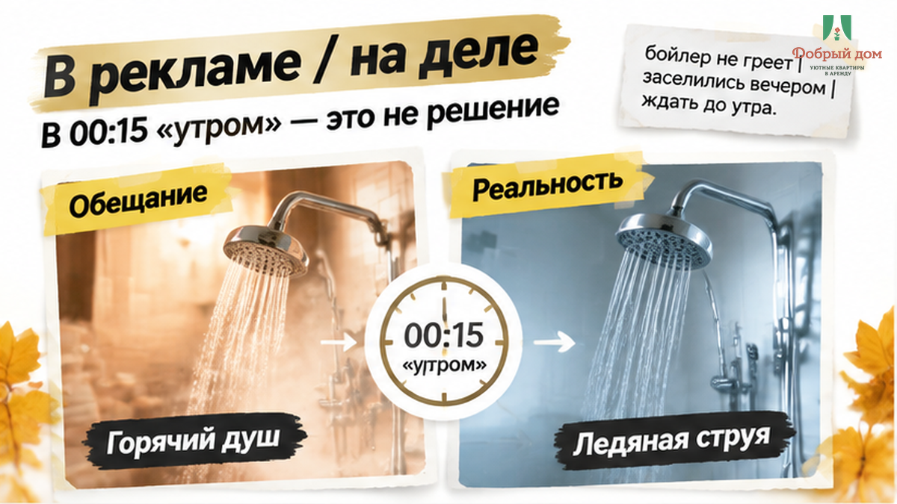

RUNTIME: inside derouter description. Output ONLY valid JSON for description-brief.json, no markdown.

topic_id B03
h1: Заселились на ночь. «Бойлер нагреется утром» — бронь 5 400 ₽
Lead excerpt from article (do not copy h1):
<h1>Заселились на ночь. «Бойлер нагреется утром» — бронь 5 400 ₽</h1>

23-е число, 23:40. Поезд приходит в Тюмень с опозданием. На улице минус. Семья с ребёнком добирается до квартиры, которую забронировала днём: одна ночь, 5 400 ₽, перевод на карту сразу после подтверждения.

В 00:15 мама пишет хозяину: «Горячей воды нет, идёт ледяная. Ребёнка помыть нечем».

Через одиннадцать минут приходит ответ: «Бойлер нагреется утром».

Вот где вас подставят. Не в момент, когда выбираете фото. А после перевода, когда чемодан уже в прихожей, ребёнок устал, а искать новую квартиру ночью почти нереально.

Покажу, что спросить до оплаты, чтобы одна ночь не превратилась в ночёвку без воды за 5 400 ₽.

<strong>Быстрый инсайт.</strong> Горячая вода — не «удобство в карточке квартиры». Это проверка, есть ли у хоста квартира под контролем.

До перевода спросите не только «вода есть?». Спросите: <strong>что вы сделаете, если её не будет ночью?</strong>

<h2>В 00:15 «утром» — это не решение</h2>

Ключи лежали в электронном ящике. Код был в сообщении. Подъезд семья нашла не с первого раза.

Казалось бы, добрались. Сейчас душ, сон — и утром по делам.

Но из крана пошла ледяная вода.

В 07:20 сообщение переслали мне: семья искала, куда переехать на вторую ночь. Горячей воды к утру так и не появилось. Выяснилось, что бойлер был выключен из розетки за щитком.

Включить было некому. Хозяин живёт в другом городе и сдаёт квартиру удалённо.

За ночь без горячей воды семья заплатила 5 400 ₽. Деньги не вернули. Перевод был на карту, квитанции не было, договора не было. Осталась только переписка.

И я увидел там не какую-то хитрую схему. Обычную беду: человек сдаёт квартиру, но не держит её в руках.

Я хост посуточной в Тюмени. Это «Добрый дом».

<h2>Сломался не бойлер. Сломалась вся цепочка</h2>

Бойлер — просто техника. Она может отключиться или сломаться у любого.

У меня зимой в одной квартире дважды за сезон срабатывал автомат на линии водонагревателя. Оба раза поздно вечером.

Разница не в том, что у нас техника волшебная.

Разница в другом. Гость получает не только код от ключницы. Он знает, где щиток, какой автомат подписан «бойлер» и по какому номеру можно позвонить в 00:15.

В этой ис

Requirements: klyshin_case_hook, geo Тюмень, not_equal_title, dzen teaser 1-2 sentences, mention night shower/boiler case not Shakin.
