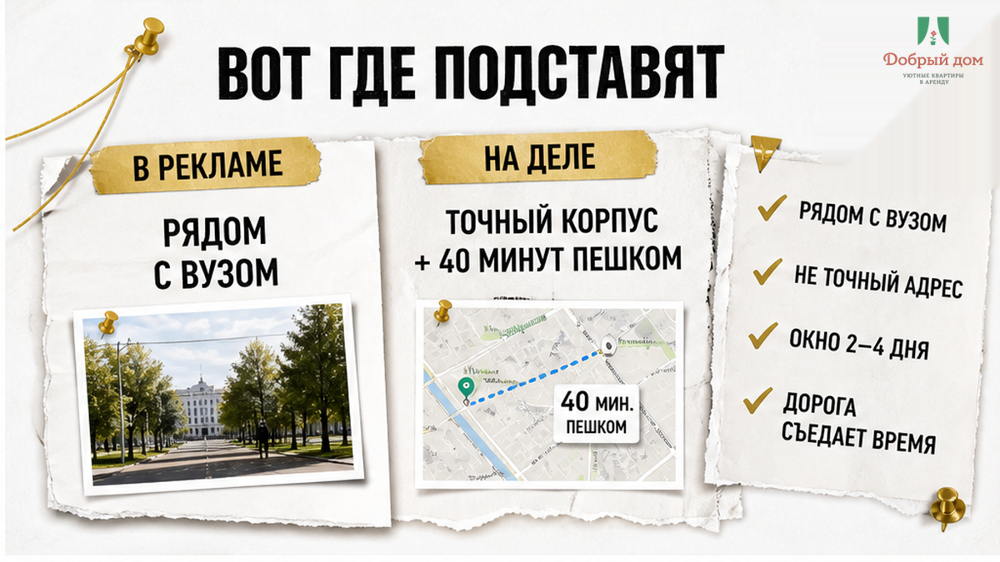
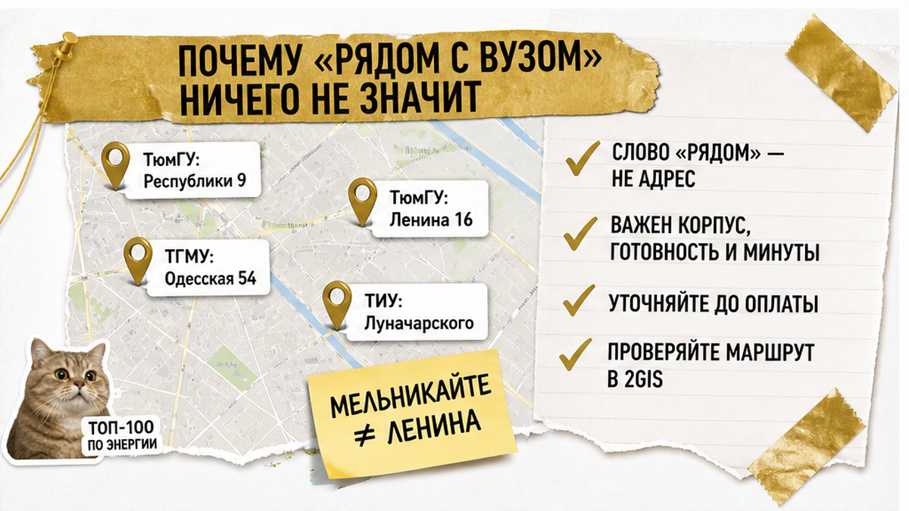
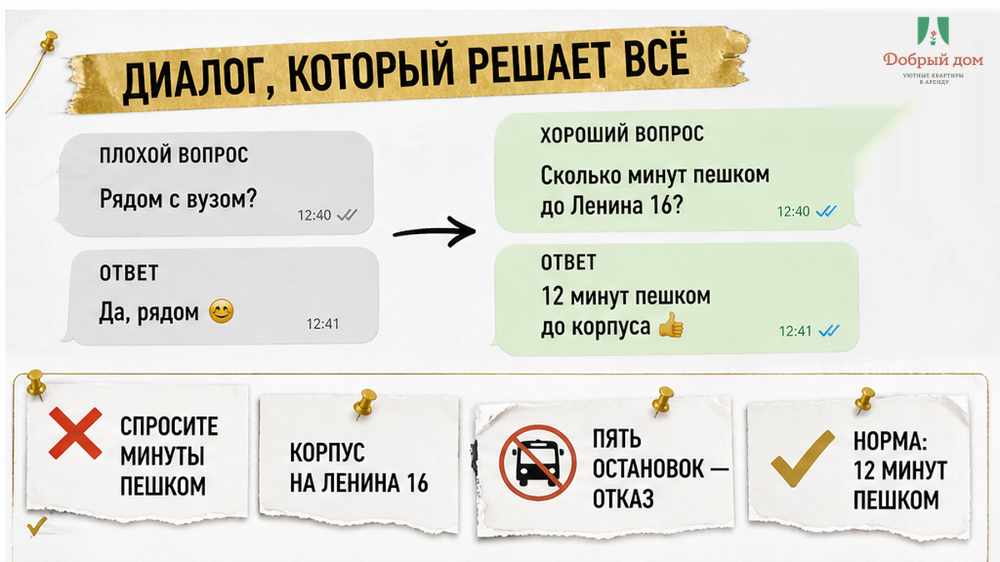
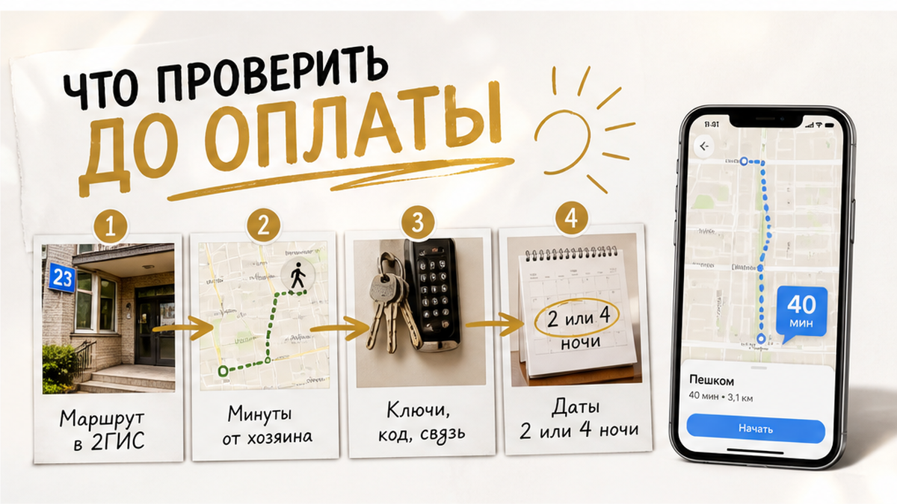

# Sol inputs B03 — rewrite Writer into tenant SOUL final article.html

## CRITICAL
- ALL facts, links, funnel hooks, interlinks from writer MUST survive
- h1 NOT in output (theme adds: «Заселил сына на три ночи — до корпуса 40 минут пешком»)
- HTML fragment ONLY — no fences, no DOCTYPE, no h1
- ~900–1400 words, Klyshin delivery, NO encyclopedia replacing scene
- NO new facts/URLs beyond writer+research
- NO TL;DR, «В этой статье», ЕГРН, Шакин, риэлтор, legal disclaimer
- Mid fight-question → TG/MAX only, never «напишите в комментариях»

## Figure placement (replace <!-- FIGURE --> comments)

After `<h2>Вот где подставят</h2>`:
<figure class="inline-quad" data-slot="inline_1"></figure>

After `<h2>Почему «рядом с вузом» ничего не значит</h2>`:
<figure class="inline-quad" data-slot="inline_2"></figure>

After `<h2>Диалог, который решает всё</h2>`:
<figure class="inline-quad" data-slot="inline_3"></figure>

After checklist `</ul>` under «Что проверить до оплаты»:
<figure class="inline-quad" data-slot="inline_4"></figure>

After seasonal H2 «Конец августа»:
<figure class="inline-quad" data-slot="inline_5"></figure>

After `<h2>Как у нас в «Добром доме»</h2>`:
<figure class="inline-quad" data-slot="inline_6"></figure>

After `<h2>Частые вопросы</h2>`:
<figure class="inline-quad" data-slot="inline_7"></figure>

## Interlink (keep from writer)
- https://добрыйдом-72.рф/blog/beskontaktnoe-zaselenie-posutochno-tyumen/
- https://добрыйдом-72.рф/blog/perevel-zalog-za-posutochnuyu-na-vyezde-skazali-ne-vernem/

## Funnel (two FULL blocks — ALL channels each time)
TG https://t.me/Dobriy_dom_72 | MAX https://max.ru/id660300569233_biz | site https://добрыйдом-72.рф/ | booking https://добрыйдом-72.рф/booking/ | tel +7 (993) 574-83-22 / tel:+79935748322 | manager https://t.me/Dobriy_dom_Tyumen

Block A after moral/checklist (mid). Block B at end after usefulness.

## Writer draft (rewrite in SOUL voice — keep every fact)

Вы стоите у подъезда в семь утра. Телефон показывает 40 минут пешком.

Сын рядом, в руке папка с документами.

Вчера вы заехали на три ночи. В объявлении было написано «рядом с вузом».

Оказалось — рядом с другим корпусом.

Тот, куда сегодня к девяти, стоит на другой улице. Через реку от вашей.

Такси уже подорожало, утро, все едут.

Автобус — с пересадкой.

Сын спрашивает: «Мы успеваем?»

Вы отвечаете: «Успеваем». И идёте быстрее, чем хочется.

Квартира чистая. Хозяин вежливый. Претензий нет.

Просто слово «рядом» вы прочитали как «пять минут», а оно значило «в том же городе».

<h2>Вот где подставят</h2>

Не в цене. Не в чистоте. В одном слове.

«Рядом с вузом» — это не адрес. Это настроение объявления.

Вы приезжаете на два-четыре дня: подать документы, забрать студенческий пакет, дождаться распределения в общежитие. У вас нет запаса времени. У вас есть окно.

И это окно съедает дорога, которую никто не посчитал заранее.

<!-- FIGURE inline_1 -->

<h2>Почему «рядом с вузом» ничего не значит</h2>

У Тюменского госуниверситета нет одного адреса.

Корпуса стоят на Республики, Ленина, Перекопской, 8 Марта, Осипенко, Пржевальского, Тургенева, Семакова. Главный корпус — Республики, 9. Приёмная комиссия — Ленина, 16. Почтовый адрес для документов — Володарского, 6.

Это три разные точки на карте. И ни одна из них не общежитие.

У ТИУ — своя история: площадки на Луначарского, Мельникайте, в районе 50 лет Октября. У медуниверситета часть зданий вообще в микрорайоне КПД.

Теперь сложите. Хозяин квартиры на Мельникайте честно пишет «рядом с вузом». Он не врёт. Он просто имеет в виду не ваш корпус.

А вам завтра к девяти на Ленина.

<!-- FIGURE inline_2 -->

<h2>Диалог, который решает всё</h2>

Обычно спрашивают так:

— Вы рядом с университетом?

— Конечно, рядом.

Всё. Разговор закончен, ошибка уже произошла.

Спрашивать надо иначе. Вот отмычка:

<strong>— Сколько минут пешком до корпуса на Ленина, 16?</strong>

Не «до вуза». До адреса. Названного вслух.

Дальше слушайте, что вам ответят.

— Ну, минут пятнадцать-двадцать, тут всё близко.

Нет. «Тут всё близко» — это не минуты.

— Автобус пять остановок, быстро.

Нет. Пять остановок в восемь утра — это не пять минут.

— Приедете, разберётесь на месте.

Нет. Так не бронируем.

Нормальный ответ звучит скучно и конкретно: «От нас до Ленина, 16 — 12 минут пешком, я сейчас скину маршрут». И скидывает.

Если хозяин не может назвать цифру по вашему адресу до оплаты — он не назовёт её и после.

<!-- FIGURE inline_3 -->

<h2>Мораль простая</h2>

Сначала адрес корпуса и маршрут. Потом деньги и ключ.

Не наоборот. Никогда не наоборот.

Вы приехали не жить в квартире. Вы приехали успеть в конкретную дверь в конкретное утро. Квартира — это транспортное решение, а не картинка с диваном.

<h2>Что проверить до оплаты</h2>

<ul>
<li>Узнайте точный адрес корпуса, куда идёт ребёнок. Не «университет» — улица и дом. У приёмной комиссии, общежития и учебного корпуса адреса разные.</li>
<li>Постройте маршрут сами: 2ГИС, Яндекс Карты или Google Maps, от адреса квартиры до этого дома. Пешком и на транспорте.</li>
<li>Смотрите на утренний вариант, не на ночной. Пробки и интервалы автобусов меняют картину.</li>
<li>Спросите хозяина цифру в минутах по вашему адресу — и сверьте с картой.</li>
<li>Уточните, кто встречает и как попадаете внутрь: ключ, код, кто на связи. Если заезд без встречи — <a href="https://добрыйдом-72.рф/blog/beskontaktnoe-zaselenie-posutochno-tyumen/">инструкция должна прийти заранее, а не «на месте разберёмся»</a>.</li>
<li>Проговорите деньги письменно: цена за ночь, что входит, есть ли залог и когда он возвращается. Устные договорённости на выезде <a href="https://добрыйдом-72.рф/blog/perevel-zalog-za-posutochnuyu-na-vyezde-skazali-ne-vernem/">имеют свойство меняться</a>.</li>
<li>Зафиксируйте даты. Два дня или четыре — от этого зависит, продлевать ли и по какой цене.</li>
</ul>

<!-- FIGURE inline_4 -->

Развёрнутый чеклист для поездки с ребёнком-абитуриентом — что спросить, что сфотографировать, что уточнить по датам — мы держим в своём канале: <a href="https://t.me/Dobriy_dom_72">t.me/Dobriy_dom_72</a>. Там же выкладываем свободные даты по своим квартирам.

<h2>Вопрос, на который у всех разный ответ</h2>

Сколько минут пешком — это ещё нормально, а после какой цифры вы уже не бронируете?

Кто-то говорит: 15 минут — предел. Кто-то спокойно ходит 25 и считает это прогулкой. А кто-то с чемоданом и ребёнком не готов и на 10.

Напишите свою цифру нам в <a href="https://t.me/Dobriy_dom_72">Telegram-канал</a> или в <a href="https://max.ru/id660300569233_biz">MAX</a> — мы соберём ответы и покажем, где проходит реальная граница у родителей. Это полезнее любых средних по рынку.

<h2>Конец августа: почему окно узкое</h2>

Заселение первокурсников в общежития ТИУ в 2026 году начинается с 28 августа. Первая волна — 28 августа по 2 сентября. Мест подготовлено 1519 в 13 общежитиях, кампусы на Луначарского, Мельникайте, Республики.

Вот та самая цифра, которую стоит подержать в голове: 1519 мест в 13 корпусах на нескольких площадках. Даже с общежитием адрес временной квартиры может оказаться важнее, чем формулировка «рядом с ТИУ».

По контрактникам результаты по общежитию могут быть известны ближе к 31 августа. Отсюда и берётся короткое окно 28–30 августа, когда семье нужно где-то жить два-три дня.

Это не значит, что квартира нужна каждому первокурснику. Многим не нужна вообще. Но если она нужна вам — окно совпадает с окном ещё у части семей, и выбирать приходится быстро.

Спрос виден и по цифрам поиска: «квартиры посуточно Тюмень» — 5875 запросов, «снять квартиру посуточно в Тюмени» — 1902. Предложение тоже большое: только на одном агрегаторе по Тюмени около 4026 объявлений. Проблема не в том, что вариантов мало. Проблема в том, что 4026 объявлений «рядом» — это 4026 разных «рядом».

<!-- FIGURE inline_5 -->

<h2>Как у нас в «Добром доме»</h2>

Мы работаем просто: сначала спрашиваем, куда вам утром.

Не «на сколько ночей», а «в какой корпус и к какому времени». Потому что от этого зависит, подойдёт вам наша квартира или честнее сказать «в этот раз не наш вариант».

Дальше называем маршрут по вашему адресу — до оплаты, а не после. Если пешком далеко, так и говорим: далеко, вот транспорт, вот сколько это займёт утром.

Инструкцию по заезду отправляем заранее. Чтобы вы не разбирались с дверью и кодом в темноте после дороги.

Квартиры — comfort+: чисто, тепло, есть где разложить документы и погладить рубашку. Без пафоса, просто нормально для семьи на три ночи.

<!-- FIGURE inline_6 -->

Хотите проверить свой корпус до бронирования — напишите адрес менеджеру в <a href="https://t.me/Dobriy_dom_Tyumen">Telegram</a> или в <a href="https://max.ru/id660300569233_biz">MAX</a>. Посчитаем минуты по карте и ответим честно, даже если ответ «вам удобнее ближе к Ленина».

<h2>Частые вопросы</h2>

<h3>Мы едем на две ночи. Стоит ли вообще заморачиваться с маршрутом?</h3>

Особенно стоит. На две ночи у вас нет запасного дня. Одно опоздание — и переносить некуда.

<h3>Хозяин пишет «5 минут до университета». Верить?</h3>

Проверить. Откройте карту и постройте маршрут от адреса квартиры до адреса вашего корпуса. Тридцать секунд, и вопрос закрыт.

<h3>А если нужный корпус только уточняется?</h3>

Тогда ориентируйтесь на приёмную комиссию и центр. Адреса приёма документов и расписание вуза лучше смотреть на официальных страницах — например, <a href="https://www.utmn.ru/abiturient/poryadok-priema-dokumentov/">порядок приёма документов ТюмГУ</a> и <a href="https://www.tyuiu.ru/vnimanie-zaselenie-v-obshhezhitie-informatsiya-dlya-pervokursnikov-i-ih-roditelej/">информация ТИУ по заселению в общежитие</a>.

<h3>Общежитие дадут — квартира не нужна?</h3>

Часто так и есть. Но заселение идёт волнами с 28 августа, и между приездом и ключом от комнаты иногда есть пара суток.

<h3>Можно продлить, если общежитие задержится?</h3>

Спрашивайте сразу при бронировании, а не в последний вечер. Мы отвечаем по конкретным датам, наличие всегда подтверждаем отдельно.

<!-- FIGURE inline_7 -->

<h2>Коротко</h2>

«Рядом с вузом» — не адрес.

Адрес корпуса. Маршрут на карте. Цифра в минутах. Только потом оплата.

Один вопрос хозяину — «сколько минут пешком до корпуса на такой-то улице?» — экономит вам сорок минут утром и нервы ребёнка перед очередью.

Если едете в Тюмень с абитуриентом и хотите посчитать минуты заранее: канал — <a href="https://t.me/Dobriy_dom_72">t.me/Dobriy_dom_72</a>, менеджер — <a href="https://t.me/Dobriy_dom_Tyumen">t.me/Dobriy_dom_Tyumen</a>, <a href="https://max.ru/id660300569233_biz">MAX</a>. Квартиры и даты — на сайте <a href="https://добрыйдом-72.рф/">добрыйдом-72.рф</a>, бронирование — <a href="https://добрыйдом-72.рф/booking/">добрыйдом-72.рф/booking</a>. Телефон: <a href="tel:+79935748322">+7 (993) 574-83-22</a>.

Напишите адрес корпуса — посчитаем дорогу до того, как вы заплатите.

## Output: final article.html HTML fragment only
