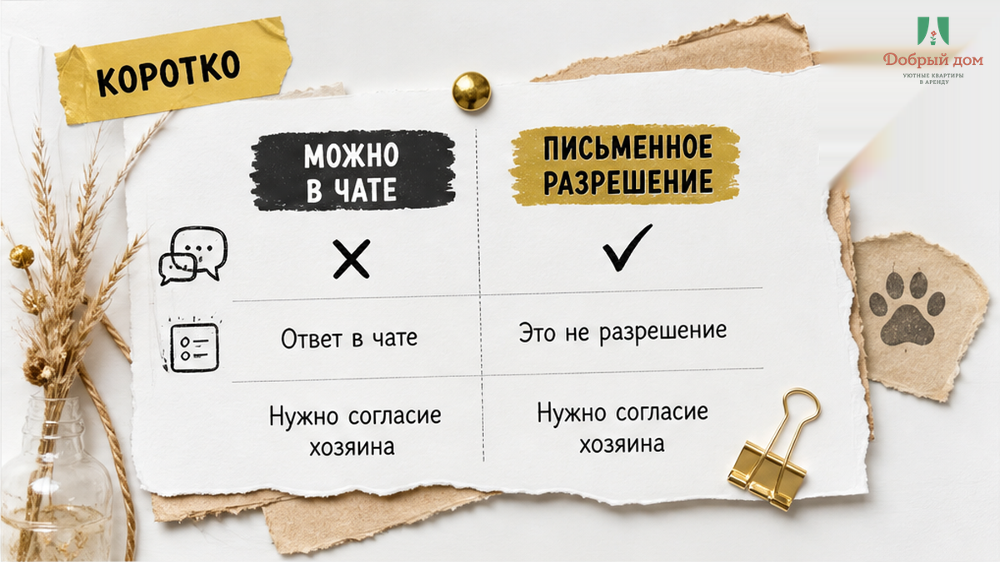

# Sol inputs B03

DO NOT say BLOCKER. All source text is below. Rewrite into final article.html.

## title-brief.json
{"title":"Забронировал жильё с собакой — у двери сказали: «Не пустим»","verdict":"PASS"}

## SOUL excerpt
# SOUL.md — слог письма для агента **Sol**

Этот файл читает **Sol** (`excalibur-blog-sol`), когда переписывает
смысл из `drafts/writer.html` в финальный `article.html`.

Writer смысл уже собрал. Ты (Sol) даёшь **слог** по правилам ниже
и по `shared/soul-examples/`.

Тенант: **«Добрый дом»** — посуточная аренда квартир в **Тюмени** (только здесь сдаём).
Голос: **тёплый хост**, как объясняешь другу у двери подъезда. Не юрист, не договор.

**Калибровка ритма (delivery Клышина, смысл наш):** короткие удары, сцена в **первом абзаце**, «вот где вас подставят», «что сделать сегодня». Cable-заголовки. Мы — **хост посуточной**, comfort+, скромно. Полезнее Клышина: чеклисты, как реально проходит заселение — **не** его юридические темы.

**Дзен — поверхность дистрибуции:** первый экран = карточка ленты; статья на сайте должна стоять сама и вести в TG/MAX.

**Engagement (лайк + коммент + подписка):** открытый вопрос / «а у вас как?» в лиде или после кейса; мягкий comment bait в середине (не кликбейт); чеклист, о котором спорят («залог всегда / никогда»); CTA в TG/MAX без жёсткого продажи — после пользы.

**Запрещённые темы/слова в тексте:** ЕГРН, нотариус, суд, «я адвокат», «мы лучшие», бизнес-класс, мрамор, люкс-отель, WhatsApp (не изобретать).

---

## Dzen feed — 5 паттернов (слог Sol)

1. **Нумерованный список** — если H1 обещает «5 вопросов», в теле ровно 5; формулировки разговорные, не канцелярит.
2. **Кейс с суммами** — «показываю / посчитали» с датами и реалистичными цифрами comfort+ Тюмени; не выдуманный люкс и не пустой flex.
3. **Страх → инструкция в §1** — назвать риск денег/жилья, в том же абзаце — что проверить до перевода.
4. **Контраст с ответом в лиде** — вердикт в первой фразе («дешевле посуточно»), дальше математика; не интрига ради интриги.
5. **Локальный + сезонный крючок** — район, ЖК, окно брони (август / НГ); «Тюмень» в H1 не обязательна.

Примеры shape H1 (свой текст): «5 вопросов хозяину до перевода предоплаты» · «Залог 5 000 ₽: когда удержат, когда вернут» · «Посуточно или отель на 2 ночи — где дешевле».

---

## Opening

Заголовок и **абзац 1** — крючок-сцена (не оглавление). H1 **может быть без «Тюмень»**.
Второй абзац — «вот где ломается» / «вот где подставят».

1. Сцена: залог, плита, чемодан, сообщение в телефоне — **или** страх→инструкция / контраст с ответом (Dzen §1).
2. Одна фраза — что болит **сегодня**, до оплаты/выезда.
3. «Покажу, что сделать на заселении» — без юридических оговорок.

**Быстрый инсайт** (3–6 коротких строк) — после лида, если уместно.

---

## Воронка в теле (HARD — не свалка ссылок в конце)

Две **mid-article** вставки обязательны:

**a) После сохраняемого чеклиста** (обход при заселении / пункты «что снять»):
одна фраза вроде «полный список — в канале» + ссылка на **Telegram-канал** `https://t.me/Dobriy_dom_72`.

**b) После блока «у нас это закрыто так»** (честный залог / как работаем):
упомяни **MAX** `https://max.ru/id660300569233_biz` **или** менеджера `https://t.me/Dobriy_dom_Tyumen` —
мы **шлём инструкцию до заселения**, не в день выезда.

В конце — бронирование, телефон **+7 (993) 574-83-22**. FAIL, если текст похож на агрегаторный how-to без бренд-момента и без TG/MAX в теле.

## Core Truths

1. **Простой разговорный русский.** Короткие предложения. Слова гостя: код, ключница, залог, подъезд.
2. **Запрещён канцелярит:** «осуществить заселение», «данный объект», «в рамках», «является».
3. **Без юридического дисклеймера** в конце («не заменяет юрконсультацию» — FAIL).
4. Факты только из Writer/research. Не выдумывай коды и суммы.
5. **Комфорт+**, не люкс. Для командировок, семей, пар — без пафоса.
6. **Скромный бренд:** один честный момент «у нас так закрыто» / «инструкцию шлём заранее».
7. География **supply:** только Тюмень (ЖК, районы — когда уместно). **Demand** в Wordstat — по всей РФ.
8. Зима в тексте — один сценарий сбоя, OK. **Обложка** = текущий месяц (август ≠ снег).
9. CTA после пользы + **воронка в теле** (см. выше): TG после чеклиста, MAX/менеджер после «у нас 

## Instructions
- Output ONLY HTML starting with <h1> from title-brief
- Rewrite writer draft in Добрый дом SOUL: warm, humble, от лица компании, short paragraphs
- Keep ALL facts, links, interlinks, CTA URLs from writer draft
- Add 7 inline figure placeholders after H2 sections:
  <figure class="inline-quad" data-slot="inline_1"></figure>
  ... through inline_7 / inline-07.png — schemas/tables/sketches NOT text walls
- CTA funnel: TG after checklist, MAX/manager after «у нас так», booking+phone in finale
- August 2026 Tyumen, comfort+ not luxury
- No legal disclaimer dump

## WRITER DRAFT (rewrite this)

Человек забронировал квартиру на сутки, ещё в чате спросил: «Я с собакой, можно?» Ему ответили одним словом: «Можно». Он приехал с чемоданом, переноской и уставшим псом — и у двери услышал: «С животными не пустим». Второй вариант той же истории мягче и обиднее: пускают, но уже на пороге называют доплату за питомца, которой в переписке не было.

Если вы сейчас читаете это до поездки — сделайте три вещи прямо сегодня, до оплаты:

<ol>
  <li>Получите разрешение <strong>текстом в том же канале, где бронируете</strong>: не «можно», а «да, с собакой можно, доплата такая-то, залог такой-то».</li>
  <li>Напишите про питомца конкретно: <strong>вид, порода, вес, будет ли он один в квартире</strong>. «Маленькая собачка» у вас и у хозяина — это два разных животных.</li>
  <li>Спросите про деньги <strong>до перевода</strong>: есть ли доплата за питомца, входит ли она в стоимость уборки, меняется ли из-за собаки сумма залога.</li>
</ol>

Дальше — почему у двери ответ меняется и как не остаться на улице в чужом городе.

  
<strong>Коротко:</strong>

  <ul>
    <li>«Можно» без деталей — не разрешение, а вежливость менеджера. Разрешение — это письменно и с суммами.</li>
    <li>Отказ у двери обычно не про вашу собаку, а про то, что квартиру сдаёт один человек, а решение по животным принимает другой.</li>
    <li>Доплата за питомца — нормальная практика (уборка, шерсть, чистка текстиля). Ненормально — узнать о ней на пороге.</li>
    <li>Залог и питомец — отдельный разговор: фиксируйте состояние квартиры на входе.</li>
    <li>Пять-шесть вопросов в чате до оплаты закрывают почти все сценарии «не пустим».</li>
  </ul>

<h2>«Можно» в переписке — ещё не разрешение</h2>

Когда вы пишете «я с собакой, можно?», человек на другой стороне часто отвечает автоматически. Он не знает породу, не знает, останется ли животное одно, не думает про диван и шторы. Он просто не хочет потерять бронь.

Разрешение выглядит иначе. В нём есть четыре вещи: <strong>да</strong>, <strong>какое животное</strong>, <strong>сколько это стоит</strong>, <strong>какие условия</strong> (не на кровать, не оставлять одного, свою подстилку). Если в ответе нет хотя бы суммы — считайте, что вопрос не решён.

Проверяется это одним сообщением. Напишите так, как будто вы уже подтверждаете договорённость, а не спрашиваете:

<blockquote>
  
«Бронирую на 12–14 августа. Со мной собака, [порода], [вес] кг, одна в квартире не остаётся, спит на своей подстилке. Подтвердите, пожалуйста: заселение с ней разрешено, доплата за питомца — [сумма или «нет»], залог — [сумма]. Если что-то не так, скажите сейчас, я подберу другой вариант».

</blockquote>

Ответ на такое сообщение — уже документ вашей переписки. И заодно тест: кто отвечает конкретно, тот и у двери поведёт себя предсказуемо.

<h2>Почему у двери отвечают не так, как в чате</h2>

Обычно причина скучная, а не злая.

<ul>
  <li><strong>Отвечал не тот, кто решает.</strong> Объявление ведёт один человек, квартира принадлежит другому, встречает третий. У каждого своя версия правил.</li>
  <li><strong>Правила квартиры не совпадают с правилами объявления.</strong> В карточке «можно с животными», а собственник давно попросил животных не пускать после испорченного дивана.</li>
  <li><strong>Собака оказалась крупнее ожиданий.</strong> «С собачкой» в переписке и алабай у лифта — разные разговоры.</li>
  <li><strong>Соседи.</strong> В домах, где посуточные квартиры давно на нервах у жильцов, встречающий перестраховывается.</li>
</ul>

Вам от этого не легче, но вывод практический: вопрос «а вы точно можете подтвердить заселение с животным?» стоит задавать не только менеджеру, но и тому, кто вас встречает — заранее, в переписке.

<h2>Доплата за питомца: за что берут и когда это честно</h2>

Доплата — нормально. Квартира после собаки требует другой уборки: шерсть с мягкой мебели, чистка текстиля, иногда химчистка. Хозяин закладывает это в стоимость, а не наказывает вас за любовь к животным.

Ненормально другое:

<ul>
  <li>сумму называют на пороге, когда вы уже приехали и торговаться нечем;</li>
  <li>непонятно, это разовая плата за уборку или за каждые сутки;</li>
  <li>доплата берётся наличными «мимо» брони и нигде не фиксируется.</li>
</ul>

Поэтому в чате спрашивайте не «есть ли доплата», а <strong>«сколько и за что: за весь заезд или за сутки, входит ли в неё финальная уборка»</strong>. Одна формулировка — и половина сюрпризов исчезает.

<h2>Залог и собака: где чаще всего теряют деньги</h2>

Второй сценарий обиды — не отказ у двери, а разговор на выезде: «пятно на ковре», «запах», «поцарапан плинтус». Животное в этой истории удобный виновник, даже если след был до вас.

Защита простая и работает всегда: на входе, пока не разобрали чемоданы, снимите видео по кругу — пол, мягкая мебель, углы, плинтусы, дверные наличники. Если что-то уже повреждено, отправьте фото в чат сразу, не «потом расскажу». Отдельно проговорите, <strong>меняется ли сумма залога из-за питомца</strong>: иногда меняется, и это нормально, если сказано заранее.

Как вообще устроен залог в посуточной аренде и на каких формулировках его чаще всего «съедают», мы разбирали в отдельном разборе: <a href="https://добрыйдом-72.рф/blog/perevel-zalog-za-posutochnuyu-na-vyezde-skazali-ne-vernem/">перевёл залог за посуточную, а на выезде сказали «не вернём»</a>.

<h2>Что делать, если вы уже стоите у двери и вас не пускают</h2>

Ситуация неприятная, но управляемая. По шагам:

<ol>
  <li>Откройте переписку и покажите, где вам ответили «можно». Часто этого хватает: человек звонит собственнику и вопрос решается.</li>
  <li>Если решение не меняется — просите <strong>возврат оплаты и подтверждение отказа текстом</strong> в том же канале, где бронировали. Голосом на площадке ничего не докажешь.</li>
  <li>Параллельно, не теряя времени, ищите второй вариант. С животным вечером выбор сужается быстро, поэтому звонить лучше сразу, а не после спора.</li>
  <li>Если платили через площадку — фиксируйте отказ в её чате, там решения принимаются по переписке.</li>
</ol>

И да: не соглашайтесь «спрятать» собаку. Это ровно тот путь, который заканчивается претензией на выезде.

<h2>Чеклист: 6 вопросов до оплаты</h2>

Скопируйте в чат перед переводом денег. Занимает две минуты, экономит вечер:

<ol>
  <li>Заселение с животным разрешено на мои даты — подтвердите текстом здесь?</li>
  <li>Ограничения по весу/породе есть? Моя собака — [порода, вес].</li>
  <li>Доплата за питомца — сколько и за что: за заезд или за сутки?</li>
  <li>Сумма залога меняется из-за животного? Как и когда он возвращается?</li>
  <li>Можно ли оставлять собаку одну в квартире, если я выйду на пару часов?</li>
  <li>Кто встречает и знает ли он, что я с животным?</li>
</ol>

Спорный пункт — пятый. Многие хозяева запрещают оставлять животное одно, и это честно: собака в незнакомой квартире лает и грызёт. Но если вы приехали по делам на весь день, лучше узнать об этом в чате, а не на второй день заезда.

Полный список вопросов по посуточной аренде — не только про животных, но и про залог, доплаты и заселение — мы выкладываем в своём канале: <a href="https://t.me/Dobriy_dom_72">Telegram «Добрый дом 72»</a>. Забирайте и пользуйтесь, даже если поедете не к нам.

<h2>Как это устроено у нас в Тюмени</h2>

Мы сдаём квартиры посуточно в Тюмени — уровень comfort+, без «люкса» и без сюрпризов. По животным у нас правило простое: <strong>вопрос решается до оплаты и остаётся в переписке</strong>. Если по конкретной квартире с животными нельзя — мы говорим это сразу, а не у двери, и предлагаем другой вариант из своего фонда.

Что мы проговариваем заранее: можно ли с вашей собакой именно в эту квартиру, есть ли доплата и за что, меняется ли залог, можно ли оставлять животное одно. Инструкция по заселению приходит до заезда — вместе с адресом, кодом и контактом человека, который на связи. Как это выглядит на практике, показывали здесь: <a href="https://добрыйдом-72.рф/blog/beskontaktnoe-zaselenie-posutochno-tyumen/">бесконтактное заселение в посуточной квартире</a>.

Едете в Тюмень в августе 2026 с животным? Напишите заранее, с кем и на какие даты — подберём квартиру, где вопрос закрыт до оплаты: <a href="https://max.ru/id660300569233_biz">MAX</a> или менеджер в <a href="https://t.me/Dobriy_dom_Tyumen">Telegram</a>. Август — высокий сезон, вариантов «с животными» в городе меньше, чем кажется, и разбирают их первыми.

<h2>Частые вопросы</h2>

<strong>Хозяин имеет право отказать с животным, если в объявлении написано «можно»?</strong> 
На практике вы упрётесь не в правоту, а в закрытую дверь. Поэтому ценность не в споре, а в письменном подтверждении до оплаты: с ним отказ превращается в возврат денег, без него — в ваше слово против чужого.

<strong>Кот — это тоже «животное»?</strong> 
Да, и спрашивать нужно так же. Хозяева считают кота проблемой из-за мягкой мебели и запаха, так что «маленький и тихий» — не аргумент. Проще написать честно и получить честный ответ.

<strong>Что делать, если доплату называют уже на пороге?</strong> 
Показать переписку, где её не было. Если хозяин настаивает — решайте по сумме: иногда дешевле заплатить и заехать, чем искать жильё вечером. Но требуйте зафиксировать доплату в чате, чтобы она не всплыла второй раз при возврате залога.

<strong>Как доказать, что пятно было до нас?</strong> 
Видео при заезде и сообщение в чат в первый час. Это единственное, что работает без нервов на выезде.

<h2>Итог</h2>

Отказ у двери с собакой на поводке — почти всегда результат одного пропущенного сообщения. Спросите про животное конкретно, получите ответ с суммами, снимите видео на входе — и поездка станет обычной поездкой, а не квестом.

Нужна квартира в Тюмени, где с животным всё согласовано заранее: <a href="https://добрыйдом-72.рф/booking/">забронировать</a> или позвонить <a href="tel:+79935748322">+7 993 574-83-22</a>.

А у вас так было? Напишите в комментариях, какая формулировка в чате сработала, а после какой всё равно сказали «не пустим» — соберём рабочие варианты в одном месте.

